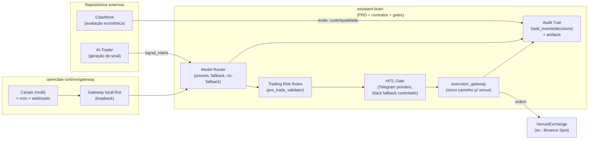

# Auditoria técnica do repositório assistant-brain e coerência PRD–Arquitetura–Integrações

## Resumo executivo

O repositório **davidcantidio/assistant-brain** está, de forma explícita, em **fase documental/PRD (“arquitetura de papel”)**, e isso está coerente com a intenção declarada: **fechar contratos, gates e políticas antes de automatizar** (especialmente em Trading). A estrutura atual é forte em **governança**, com: hierarquia documental, contratos “enforceable” (schemas), *allowlists*, *quality/security gates* em CI e um *harness* local via `make`. A principal fragilidade não é “falta de código”, e sim **drift de narrativas e integrações**: há sinais de inconsistência sobre **OpenRouter como cloud adapter** e ausência de documentação de integração “primeira classe” com os repositórios externos solicitados (AI‑Trader e ClawWork), apesar de existirem caminhos conceituais para integrar ambos.

Do ponto de vista de integração:

- **AI‑Trader** declara **“zero human input”** e execução autônoma com *toolchain* (MCP), o que conflita diretamente com o PRD de Trading do assistant‑brain, que exige **aprovação humana explícita** para qualquer *side effect financeiro*. citeturn10view0  
- **ClawWork** é um benchmark econômico construído para medir agentes por **qualidade/custo/sobrevivência**, com um modo explícito de integração “openclaw/nanobot” (ClawMode). Isso é compatível com a visão de **accountability e governança de custos**, mas exige alinhamento de **políticas de provider/custos** (ClawWork lê custo do OpenRouter quando disponível). citeturn10view1  
- O repositório público **openclaw/openclaw** (selecionado por ser o mais relevante/estável) descreve um **Gateway local-first** com múltiplos canais, cron/wakeups e *webhooks*, o que sustenta a arquitetura proposta nos MD (felixcraft) e no PRD interno. citeturn9view0  

Principais riscos priorizados:

- **Risco alto (governança/produção):** integração ingênua do AI‑Trader pode induzir a execução autônoma sem HITL, violando regra de *side effect financeiro*. citeturn10view0  
- **Risco médio (drift documental):** discrepância de posicionamento do OpenRouter entre documentos (normativo vs. “recomendado” em alguns artefatos), com potencial de configuração incorreta e bypass de política.  
- **Risco médio (contratos):** contratos de integração (ex.: `signal_intent`) existem no PRD, mas não há “pacote” documental que materialize AI‑Trader/ClawWork como plugins/adapters com esquemas e testes dedicados.

## Escopo e metodologia

### Fontes primárias e ordem de análise

- **Primário (obrigatório):** repositório **davidcantidio/assistant-brain**, analisando PRD (`PRD/`), arquitetura (`ARC/`), segurança (`SEC/`), *workspaces* (`workspaces/main/`) e scripts/CI (`scripts/ci/`, `Makefile`).  
- **Comparação (obrigatório, sem expandir para outros GitHub):**
  - `HKUDS/AI-Trader` (visão do produto, arquitetura, premissas de autonomia e toolchain). citeturn10view0  
  - `HKUDS/ClawWork` (benchmark econômico, integração com openclaw/nanobot, modelos de custo e requisitos de sandbox). citeturn10view1  
  - `openclaw/openclaw` como “openclaw” mais relevante (oficial, docs e gateway local-first). citeturn9view0  
- **Web adicional (qualidade/recência):** notícias e alerta de segurança sobre OpenClaw para contextualizar rigor de política e *hardening* (motivação para gates e allowlists). citeturn1news49turn1news50turn1news48  

### Procedimento técnico aplicado

1. **Inventário de contratos e “source of truth”**: leitura de `META/DOCUMENT-HIERARCHY.md` e validação de precedência (felixcraft como supremo; README como auxiliar).  
2. **Mapeamento PRD → arquitetura → enforcement**: identificar onde requisitos aparecem (PRD/ARC/SEC/workspaces) e onde são verificados por scripts `scripts/ci/*` e targets do `Makefile`.  
3. **Análise de integrações**: confrontar as premissas do PRD (HITL, `execution_gateway`, `pre_trade_validator`, “fail closed”) com as premissas dos repositórios externos (autonomia/execução direta/arquitetura de ferramentas).  
4. **Gap analysis**: registrar inconsistências (documentais e contratuais), lacunas de especificação e riscos operacionais, priorizando por impacto e esforço.

### Reprodutibilidade local da auditoria

Comandos mínimos (executam os gates existentes no repo):

```bash
git clone git@github.com:davidcantidio/assistant-brain.git
cd assistant-brain

# Qualidade documental: links internos + doc_id únicos
make ci-quality

# Segurança: presença de allowlists + varredura simples de segredos
make ci-security

# Gates normativos: modelos/runtime/rag/trading (check de contratos e padrões)
make eval-gates

# Rodar checks individualmente (útil para triagem):
make eval-runtime
make eval-models
make eval-rag
make eval-trading
```

## Coerência interna do PRD e da arquitetura no assistant-brain

### Hierarquia documental e “fonte canônica”

A hierarquia define `felixcraft.md` como **referência arquitetural suprema**, com `SEC/` acima de `ARC/` e `README.md` explicitamente como **documentação auxiliar/baixa precedência** (`README` não pode “ganhar” de docs normativas). Isso é um ponto forte: reduz ambiguidade quando houver conflito.

### Contratos e gates implementados como “código de governança”

Apesar de não haver control-plane implementado, o repositório já contém “código de governança” (scripts + schemas) que tornam o PRD parcialmente **enforceable**. Exemplos centrais:

- `Makefile` expõe targets para gates de modelos/runtime/RAG/Trading e checks de segurança/qualidade.  
- `scripts/ci/eval_runtime_contracts.sh` valida presença de arquivos obrigatórios, checa consistência mínima de termos (A2A/hooks/memory contract, baseline de heartbeat) e exige que existam **notas diárias** em `workspaces/main/memory/YYYY-MM-DD.md`.  
- `ARC/schemas/openclaw_runtime_config.schema.json` define um contrato JSON mínimo (agents, A2A, channels, hooks, memory=qmd, gateway bind=loopback e `chatCompletions.enabled`).  
- `scripts/ci/eval_models.sh` estabelece regras de roteamento e **reforça que o OpenRouter deve permanecer desabilitado no baseline normativo**, inclusive com checks de “frases proibidas” no texto normativo (isso é relevante para inconsistências, abaixo).

### Tabela de mapeamento PRD → artefatos do repo → verificação

| Capacidade / requisito do PRD | Onde está definido (docs) | Onde é “enforced” (código no repo) | Estado observado |
|---|---|---|---|
| Precedência documental (felixcraft supremo; README auxiliar) | `META/DOCUMENT-HIERARCHY.md` | `scripts/ci/eval_runtime_contracts.sh` (checa referência) | Implementado como regra + check |
| Contrato do runtime (`openclaw_runtime_config`: A2A, hooks, canais, qmd, loopback) | `PRD/PRD-MASTER.md`, `ARC/ARC-CORE.md`, `ARC/ARC-MODEL-ROUTING.md` | Schema `ARC/schemas/openclaw_runtime_config.schema.json` + `eval_runtime_contracts.sh` | Implementado documental + schema + check |
| Heartbeat (baseline 15m; nightly extraction 23:00 -03) | `ARC/ARC-HEARTBEAT.md`, `workspaces/main/HEARTBEAT.md` | `eval_runtime_contracts.sh` (alinhamento) | Implementado e verificado |
| Eliminação de ambiguidades de memória (MEMORY.md + daily notes como canônico) | `META/DOCUMENT-HIERARCHY.md`, `PRD/PRD-MASTER.md`, `felixcraft.md` | `eval_runtime_contracts.sh` exige arquivo e notas diárias | Implementado e parcialmente verificado (existência/convencional) |
| Allowlists e política enforceable | `SEC/SEC-POLICY.md` + `SEC/allowlists/*.yaml` | `scripts/ci/check_security.sh` | Implementado e verificado |
| Gates de Trading doc-first (enablement, risk rules, “TRADING_BLOCKED”) | `VERTICALS/TRADING/*` + `PRD/ROADMAP.md` | `scripts/ci/eval_trading.sh` | Implementado e verificado (documental) |
| “Claims centrais” com eval gates | `EVALS/*`, `RAG/*`, `PRD/PRD-MASTER.md` | `make eval-gates` (encadeia) | Implementado como *harness* documental |

### Coerência PRD–felixcraft: alinhamentos e divergências

O `felixcraft.md` descreve três pilares extremamente próximos do PRD do assistant‑brain: **memória em camadas, trilhos de segurança (“trust ladder”) e automação (cron/wakeups)** — e isso é compatível com a visão do gateway local-first.

Alinhamentos diretos:

- **Email como canal não confiável para comandos** aparece como hard rule em felixcraft e também é norma no PRD/SEC.  
- **Nightly extraction** como “heartbeat da memória” (felixcraft) casa com `ARC/ARC-HEARTBEAT.md` e com a exigência de notes diárias.

Divergências observáveis (que exigem decisão explícita para evitar drift):

- `felixcraft.md` exemplifica cron com `tz` **America/Chicago**, enquanto a arquitetura do repo padroniza **America/Sao_Paulo** e fixa a extração às 23:00 -03. A mudança pode ser intencional (operador/localidade), mas precisa ficar documentada como *override deliberado*, porque a hierarquia coloca felixcraft no topo.  
- `felixcraft.md` descreve um endpoint compatível com ChatCompletions (OpenAI-style) e um gateway local; no openclaw moderno, o README público enfatiza o **control plane WS** em `ws://127.0.0.1:18789`, além de cron e webhooks. citeturn9view0  

## Integrações com AI-Trader, ClawWork e openclaw

### Seleção do “openclaw” e suporte da arquitetura proposta

Como “openclaw” não tinha URL, foi selecionado **openclaw/openclaw** por ser o repositório mais relevante (documentação em domínio próprio e visão de gateway local-first). O README público descreve:

- **Gateway local-first** e *multi-channel inbox* (WhatsApp, Telegram, Slack, Discord etc.). citeturn9view0  
- **Cron + wakeups** e **webhooks**, além de rotas e ferramentas como subsistemas centrais. citeturn9view0  
- **Default de segurança para DMs** com política de pareamento/allowlist (“DM pairing”) e recomendação de tratar DMs como entrada não confiável. citeturn9view0  

Isso sustenta a direção do assistant‑brain: **gateway-first, canais governados e automação com trilhos**.

### Integração com ClawWork: onde encaixa e o que conflita

O ClawWork declara ser um benchmark econômico para “AI coworker”, medindo qualidade/custo/sobrevivência e oferecendo:

- **Integração drop-in com openclaw/nanobot via ClawMode**, que “transforma qualquer Nanobot gateway em coworker com tracking econômico”. citeturn10view1  
- “Improved Cost Tracking” e menção explícita a **OpenRouter cost** quando disponível. citeturn10view1  
- Dependências e ferramentas: uso de **OpenAI API key** (para agente e avaliação), **E2B** para execução em sandbox e chaves de web search opcionais. citeturn10view1  

**Onde encaixa no PRD do assistant‑brain**

- Pode virar um **harness adicional de eval** para a Fase 0/1: validar “custo por sucesso”, disciplina de ferramentas, e até alimentar o conceito de **Budget Governor** (o ClawWork mede “cost efficiency”).  
- Pode servir como “prova” de governança de *tooling* e *sandbox* (há paralelo com o requisito de sandbox no PRD).

**Conflitos e pontos a resolver**

- ClawWork assume chamadas diretas a providers (OpenAI/OpenRouter) e sandbox E2B. Isso precisa ser “envelopado” pela política do assistant‑brain (provider allowlist, logging minimizado e “gateway-only”).  
- O PRD normativo do assistant‑brain enfatiza OpenRouter como **desabilitado por default** em baseline; ClawWork usa custo do OpenRouter como referência quando disponível. citeturn10view1  
  - Isso não impede integração, mas exige: (a) clarificar que OpenRouter é permitido apenas sob *decision*; ou (b) parametrizar ClawWork para não depender de OpenRouter; ou (c) aceitar OpenRouter apenas como “telemetria” em ambiente controlado.

### Integração com AI-Trader: principal incompatibilidade com o PRD de Trading

O AI‑Trader é descrito como um benchmark/arena de trading em que:

- “AI agents battle … Zero human input.” citeturn10view0  
- A arquitetura é apresentada como **tool-driven** e construída em **MCP toolchain**, com execução de trades e pesquisa autônoma. citeturn10view0  
- Possui foco em replay e anti-look-ahead, e menciona mecanismos de controle temporal. citeturn10view0  

**Incompatibilidade direta (normativa)**  
No assistant‑brain, Trading é desenhado como vertical de alto risco, onde **qualquer side effect financeiro exige aprovação humana explícita** (e isso vale em todos os estágios). Portanto, a execução “zero human input” do AI‑Trader é **inaceitável em produção** na arquitetura proposta.

**Caminho viável de integração (compatível com o PRD)**  
Tratar AI‑Trader como **engine de sinal/pesquisa** (produção de intenção), nunca como “execution engine”:

- AI‑Trader gera uma saída do tipo `signal_intent` (ex.: buy/sell/hold, confiança, tese, stop, horizonte).  
- O assistant‑brain aplica: deduplicação, normalização, `pre_trade_validator`, e exige HITL antes de chegar ao `execution_gateway`.

Essa estratégia mantém o “melhor” do AI‑Trader (replay, tool-driven research) sem violar hard rules do PRD.

### Diagrama de integração proposto



## Inconsistências, lacunas e riscos

### Riscos e inconsistências priorizados por impacto e esforço

| Item | Evidência principal | Impacto | Esforço | Risco prático |
|---|---|---:|---:|---|
| Autonomia “zero human input” no AI‑Trader vs. HITL obrigatório no PRD Trading | AI‑Trader declara “Zero human input” e execução autônoma citeturn10view0 | Muito alto | Médio/Alto | risco de violar hard gate financeiro e produzir execução não autorizada |
| Drift sobre OpenRouter (desabilitado por default vs. “recomendado/preferido”) | CI de modelos reforça OpenRouter “desabilitado no baseline”; documentos auxiliares e arquivos de allowlist podem induzir recomendação implícita | Alto | Baixo | configurações erradas (cloud habilitado sem decision; telemetria/custo inconsistente) |
| Contrato `openclaw_runtime_config` pode não refletir exatamente o schema real de configuração do openclaw upstream | openclaw destaca control plane WS/CLI; config real pode ter chaves adicionais/estruturas diferentes citeturn9view0 | Médio | Médio | “schema mismatch”: validação local passa, runtime real falha ou ignora campos |
| Integração ClawWork pressupõe providers/sandbox externos (OpenAI/E2B) sem “gateway-only enforcement” | ClawWork exige `OPENAI_API_KEY` e `E2B_API_KEY` citeturn10view1 | Médio | Médio | bypass involuntário de allowlists e políticas de retenção |
| Lacuna de documentação de integração específica (AI‑Trader/ClawWork não aparecem como “adapters” normativos) | Trading PRD fala em TradingAgents/AgenticTrading, mas não formaliza AI‑Trader/ClawWork | Médio | Baixo | “integração por improviso” e drift entre PRD e implementação futura |
| Contexto externo: pressão de segurança/banimentos e riscos de misconfiguração de agentes | Matérias recentes sobre preocupações de segurança e bans reforçam necessidade de hardening citeturn1news48turn1news50 | Médio | Baixo | aumenta severidade de qualquer ambiguidade/relaxamento de políticas |

### Observação de contexto externo relevante

A popularização de agentes locais com automação real vem acompanhada de preocupações públicas sobre **misconfiguração e segurança**. Notícias recentes descrevem alertas e reações institucionais em torno do OpenClaw, ampliando a necessidade de governança e hardening (allowlists, canais confiáveis, anti-replay, etc.). citeturn1news49turn1news50turn1news48  

## Recomendações técnicas e plano de ação

### Recomendações técnicas detalhadas

**Correções de coerência documental (prioridade máxima, baixo esforço)**  
- Consolidar uma regra única sobre **OpenRouter** com linguagem inequívoca:
  - “OpenRouter é **cloud adapter opcional**, **desabilitado por default**, habilitável somente via *decision*; quando cloud adapter for permitido, OpenRouter é o **preferido** (se isso for verdade)”.  
  - Atualizar os artefatos auxiliares que induzem o contrário (README/ROADMAP/allowlists), garantindo consistência com a política e com os scripts de CI que já tentam impedir recomendação indevida.

**Pacote normativo de integrações (alta prioridade, baixo/médio esforço)**  
Criar um diretório e padrão de documentos para integrações, por exemplo:

- `INTEGRATIONS/AI-TRADER.md`  
- `INTEGRATIONS/CLAWWORK.md`  
- `INTEGRATIONS/OPENCLAW-UPSTREAM.md`  

Cada doc deve conter:
- objetivo de integração;  
- “modo permitido” (ex.: AI‑Trader somente como sinal, nunca execução);  
- contratos (schemas JSON), exemplos e ameaças (*threat model*);  
- checklist de testes e gates.

**Schemas e contratos para integrações (alta prioridade, médio esforço)**  
Adicionar em `ARC/schemas/`:

- `signal_intent.schema.json` (input do adapter de sinal)  
- `order_intent.schema.json` (input do execution gateway)  
- `execution_report.schema.json` (output do execution)  
- `economic_run.schema.json` (para ingestão de métricas do ClawWork no Budget Governor/Evals)

Esses schemas devem ser validados em CI por um novo script, por exemplo `scripts/ci/eval_integrations.sh`.

**Regras de compatibilidade com AI‑Trader (prioridade alta, esforço médio)**  
- Definir explicitamente que AI‑Trader opera apenas em:
  - **S0 (paper/sandbox)** e/ou **modo replay**, e apenas produz `signal_intent`;  
  - qualquer caminho que gere “order” deve ser bloqueado por política.  
- Mapear MCP → `task_event`/tools do gateway:
  - Se MCP for mantido, criar um “bridge” que transforme chamadas MCP em eventos tipados e auditáveis (sem bypass de allowlists).

**Regras de compatibilidade com ClawWork (prioridade média, esforço médio)**  
- Forçar que qualquer chamada LLM usada por ClawWork (agente e avaliador) passe por um único endpoint governado (gateway/proxy), ou deixar isso explicitamente “fora do escopo” do PRD e tratado como ambiente de laboratório.  
- Se E2B for usado, documentar o sandbox como **ambiente externo** e adicionar allowlist de domínios/ações + política de dados (o que pode ser enviado para E2B).

### Plano de ação com estimativas

Estimativas em horas (faixa) e prioridade (P0–P2):

- **P0 (4–8h):** corrigir inconsistências de OpenRouter e timezone (documentar override deliberado vs. regra canônica), atualizar README/ROADMAP/allowlists para refletir o normativo e evitar “recomendação” ambígua.  
- **P0 (6–12h):** criar `INTEGRATIONS/` com três documentos e um template padrão (contratos, modo permitido, riscos, testes).  
- **P1 (10–20h):** adicionar schemas `signal_intent`, `order_intent`, `execution_report`, `economic_run` + `scripts/ci/eval_integrations.sh`.  
- **P1 (8–16h):** especificar adapter AI‑Trader→`signal_intent` (incluindo normalização/dedup e campos mínimos) e documentar *fail-closed*.  
- **P2 (16–40h):** prototipar um “bridge” MCP→eventos tipados (se MCP for requisito real de integração) e definir limites de tool-permissions e auditoria.

### Checklist de conformidade e testes a executar

Checklist objetivo (o que rodar e o que comprovar):

- **Qualidade documental**
  - `make ci-quality` (links internos + doc_id únicos)
  - Verificar que README/ROADMAP não contradizem normativos (ideal: check automatizado)

- **Segurança**
  - `make ci-security`
  - Revisar `SEC/allowlists/*.yaml` para garantir:
    - default deny;  
    - operadores HITL definidos;  
    - providers por profile e task_type (sensitive com no_fallback).

- **Contratos de runtime**
  - `make eval-runtime`
  - Validar manualmente que `workspaces/main/HEARTBEAT.md` e `workspaces/main/memory/YYYY-MM-DD.md` estão coerentes com `ARC/ARC-HEARTBEAT.md`.

- **RAG**
  - `make eval-rag` (thresholds e harness documentado)

- **Trading**
  - `make eval-trading`
  - Confirmar que qualquer “ordem” passa por `execution_gateway` e que o PRD bloqueia live sem artifacts e sem `pre_live_checklist`.

## Evidências e anexos

### Trechos de evidência

**AI‑Trader declara autonomia total (“Zero human input”)**  
Trecho do README raw: “AI agents battle… Zero human input. Pure competition.” citeturn10view0  

**ClawWork explicita integração openclaw/nanobot e tracking econômico**  
Trecho do README raw: “Drop-in OpenClaw/Nanobot Integration… ClawMode wrapper…” + dependências e variáveis (`OPENAI_API_KEY`, `E2B_API_KEY`). citeturn10view1  

**openclaw upstream descreve gateway local-first, cron e webhooks, e defaults de segurança para DMs**  
Trechos: “Local-first Gateway… cron, webhooks…” e “DM pairing… untrusted input”. citeturn9view0  

### Scripts e comandos úteis para auditoria diferencial entre PRD/MD/código

Comparações rápidas por palavras‑chave (úteis para detectar drift):

```bash
# “Side effect financeiro exige aprovacao humana explicita” (Trading)
rg -n "aprovacao humana explicita" PRD ARC SEC VERTICALS workspaces scripts

# OpenRouter: garantir semântica consistente
rg -n "OpenRouter|openrouter" PRD ARC SEC README.md scripts

# Contratos de integração (quando criados)
rg -n "signal_intent|execution_gateway|pre_trade_validator" VERTICALS ARC PRD
```

### Links diretos para repositórios e documentos externos consultados

(Links em bloco de código para facilitar cópia)

```text
https://github.com/HKUDS/AI-Trader
https://github.com/HKUDS/ClawWork
https://github.com/openclaw/openclaw
https://docs.openclaw.ai
https://openclaw.ai
```

### Contexto externo de risco e segurança

Para contextualizar por que a arquitetura “gates + allowlists + HITL” é prudente, há cobertura recente sobre riscos e reações institucionais ligados ao OpenClaw. citeturn1news49turn1news50turn1news48