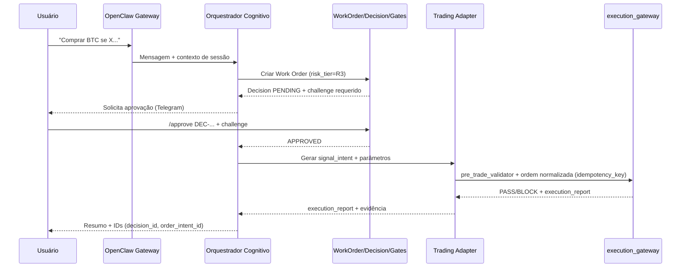

# deep-research-report.md (historico nao canonico)
> Status: historico de analise. Nao e fonte normativa de decisao; prevalece `felixcraft.md` + hierarquia oficial em `META/DOCUMENT-HIERARCHY.md`.

# Integração da arquitetura do PDF com o repositório assistant-brain

## Resumo executivo

Este relatório integra (a) a arquitetura operacional descrita no PDF fornecido (playbook para “contratar” um assistente de IA com identidade, memória e rotinas recorrentes) fileciteturn0file0 com (b) o estado atual do repositório GitHub **assistant-brain**, que já está estruturado como um “Agent OS” normativo (PRDs/RFCs/gates/allowlists) para operar um gateway/assistente com governança de risco, observabilidade, RAG e uma vertical de Trading com controles rígidos. fileciteturn84file4L1-L1 fileciteturn96file0L1-L1 fileciteturn86file0L1-L1

A principal conclusão é que **o repositório já contém a “espinha dorsal de governança”** (contratos, gates, allowlists, degraded mode, decisões HITL e trilhas de auditoria), enquanto o PDF descreve com mais ênfase **a “camada cognitiva e operacional”** (identidade/personalidade via arquivos, memória em camadas, rotinas como heartbeat e extrações noturnas, e uso de ferramentas/skills). fileciteturn84file4L1-L1 fileciteturn85file0L1-L1 fileciteturn0file0

A proposta integrada é: **usar o assistente do PDF como “cérebro/orquestrador” (camada de decisão e decomposição)**, mas **submeter toda ação com side effects** (especialmente Trading) ao arcabouço de governança já existente no repositório (Work Orders + Decision Protocol + allowlists + eval gates). Isso preserva a ergonomia e “autonomia assistida” do PDF sem abrir mão dos bloqueios e trilhas exigidos pela vertical de alto risco. fileciteturn0file0 fileciteturn84file3L1-L1 fileciteturn101file1L1-L1 fileciteturn86file3L1-L1

Sobre “Clawwork” e “trade repo”: o termo “Clawwork” **não está especificado** pelo usuário. Há forte evidência de que a referência desejada é o projeto entity["organization","HKUDS","research lab hku"] / ClawWork (open-source, integra “ClawMode” e possui diretório `clawmode_integration`), que inclusive descreve integração com gateways e comandos dedicados em seu README. citeturn4view0turn12view0 Já o “repositório de trade” foi descrito como **não especificado**, então a integração é proposta via **contratos e adaptadores** (HTTP/gRPC/fila), mantendo `execution_gateway` e `pre_trade_validator` como caminhos únicos e auditáveis (conforme a vertical Trading do repositório). fileciteturn86file0L1-L1 fileciteturn86file2L1-L1 fileciteturn86file3L1-L1

## Leitura técnica do PDF

O PDF descreve um padrão de arquitetura para assistentes “sempre ligados” com três pilares:

**Identidade e comportamento estável**: uso de arquivos tipo `SOUL.md` (persona e princípios), `IDENTITY.md` (papel, limites e estilo), e instruções de “como operar” para manter consistência entre sessões. fileciteturn0file0

**Memória em camadas e rotinas**: o texto enfatiza uma memória com separações (ex.: memória de longo prazo vs. logs diários vs. “conhecimento estruturado”), e rotinas periódicas (heartbeat e tarefas noturnas) para sintetizar, consolidar e manter o assistente “atualizado” com contexto relevante. fileciteturn0file0

**Ferramentas/skills e superfícies de comunicação**: o assistente opera via canais (mensageria) e aciona ferramentas (shell, web, arquivos, integrações) em um modelo de “assistente que executa”, não apenas conversa. fileciteturn0file0

O PDF também coloca forte ênfase em **segurança prática** (evitar obedecer texto externo como instrução; preferir fluxos de aprovação humana para certos riscos; separar “dados” de “instruções” na recuperação de contexto). fileciteturn0file0

Pontos do PDF que **não ficam claros / não aparecem explicitamente** (portanto tratados como “não especificado” nesta integração) incluem: uso de um control-plane específico (ex.: Convex), contratos formais de Work Orders e Decisions, e uma governança do tipo “RFC/gates em CI”. Quando necessário, este relatório propõe opções compatíveis com o repositório. fileciteturn0file0

## Diagnóstico do repositório assistant-brain

O repositório está organizado como um **sistema normativo/operacional** (e não apenas código), com documentos “canônicos” e regras de precedência. fileciteturn96file0L1-L1

Componentes já maduros/definidos:

**Hierarquia documental, governança e contratos**
- Existe uma hierarquia explícita de documentos e convenções (doc_id, RFC refs) que funcionam como fonte de verdade operacional. fileciteturn96file0L1-L1 fileciteturn84file1L1-L1  
- Há um contrato de **Work Order** com risco, sensibilidade, SLA, idempotência e critérios de aceite. fileciteturn84file3L1-L1  
- Há um **Decision Protocol** com HITL multi-canal (Telegram primário, Slack fallback) e challenge de segundo fator para comandos críticos. fileciteturn101file1L1-L1 fileciteturn101file2L1-L1

**Segurança**
- Existe uma Security Policy formal e políticas específicas para prompt injection, sandboxing, incident response e secrets. fileciteturn85file0L1-L1 fileciteturn85file6L1-L1 fileciteturn85file8L1-L1  
- O repositório já opera com allowlists (`DOMAINS`, `TOOLS`, `ACTIONS`, `OPERATORS`, `PROVIDERS`) com default deny. fileciteturn98file0L1-L1 fileciteturn102file0L1-L1 fileciteturn99file1L1-L1 fileciteturn101file2L1-L1 fileciteturn100file0L1-L1

**Roteamento de modelos e governança de provider**
- Modelo de roteamento com gateway padrão via entity["company","OpenRouter","llm gateway"], trilha `requested/effective`, allowlist por sensibilidade e políticas de fallback. fileciteturn85file7L1-L1 fileciteturn100file0L1-L1  
- O próprio OpenRouter documenta suporte OpenAI-API-compatible, incluindo base URL e autenticação por API key. citeturn1search0turn4view3

**Operação, observabilidade e tolerância a falhas**
- Há arquitetura para Observability (métricas, thresholds, auto-ações idempotentes + rollback). fileciteturn103file0L1-L1 fileciteturn103file9L1-L1  
- Há Degraded Mode com logs offline, replay_key/idempotency e procedimentos para incidentes (incluindo casos de Trading com posição aberta). fileciteturn103file8L1-L1 fileciteturn103file6L1-L1

**Vertical Trading (alto risco)**
- Trading é explicitamente tratado como alto risco, com rollout em etapas (paper/sandbox → micro-live → escala), gates formais, `execution_gateway` e `pre_trade_validator`, além de harness de validação (`make eval-trading`). fileciteturn86file0L1-L1 fileciteturn86file2L1-L1 fileciteturn86file3L1-L1  
- O repositório referencia integrações faseadas com entity["organization","Freqtrade","crypto trading bot"] e Binance Spot (fase 1). fileciteturn86file0L1-L1  
  - Freqtrade possui documentação oficial de REST API/servidor embutido (útil para integrar via HTTP). citeturn5search2  
  - entity["organization","Binance","crypto exchange"] mantém documentação oficial via repositório público das APIs Spot. citeturn5search5

**Onboarding e runtime**
- Há instruções de setup para entity["organization","OpenClaw","ai agent gateway"] com CLI, `.env` local e estado canônico em `workspaces/main/.openclaw/workspace-state.json` (o conteúdo do arquivo de estado não está exposto aqui; tratado como “não especificado”). fileciteturn87file0L1-L1  
- O repositório também mantém scripts de onboarding/verificação e CI gates (qualidade/segurança/evals). fileciteturn88file0L1-L1

Por fim, o repositório tem um workspace principal com arquivos de identidade e onboarding (`SOUL`, `IDENTITY`, `USER`, `BOOTSTRAP`) que espelham diretamente o padrão descrito no PDF. fileciteturn92file0L1-L1 fileciteturn93file0L1-L1 fileciteturn94file0L1-L1 fileciteturn95file0L1-L1

## Mapeamento do PDF vs. repositório atual

### Tabela comparativa de componentes

| Componente | No PDF (arquitetura) | No repositório assistant-brain | Gap/ação recomendada |
|---|---|---|---|
| Identidade / Persona (`SOUL.md`, `IDENTITY.md`) | Prescrito como núcleo do comportamento persistente. fileciteturn0file0 | Existe `workspaces/main/SOUL.md` e `workspaces/main/IDENTITY.md`. fileciteturn92file0L1-L1 fileciteturn93file0L1-L1 | Alinhar conteúdo do PDF com estes arquivos e declarar precedência (workspace > PDF). |
| “Sobre o humano” (`USER.md`) | Presença típica em setups de assistentes persistentes (quando aplicável). fileciteturn0file0 | Existe `workspaces/main/USER.md`. fileciteturn94file0L1-L1 | Garantir que o PDF não contradiz políticas de segurança; se contradizer, sobrescreve SEC. |
| Memória em camadas | Define memória operacional e rotinas de consolidação. fileciteturn0file0 | Repositório define RAG, quarantines, evals e “memory plane” vetorial (documental), mas a camada “memória pessoal” estilo diário depende do workspace (não totalmente detalhada no repo). fileciteturn96file0L1-L1 fileciteturn85file7L1-L1 | Criar uma especificação explícita de memória pessoal (arquivos/formatos) compatível com os gates do repositório. |
| Rotinas (heartbeat, tarefas noturnas) | Heartbeat + jobs recorrentes. fileciteturn0file0 | Existe artefato de heartbeat na arquitetura e baseline de operação. fileciteturn84file2L1-L1 | Explicitar “nightly extraction” do PDF como “job de manutenção” e encaixar no calendário do workspace (sem conflitar com standup/heartbeat). |
| Ferramentas e skills | Ferramentas acionáveis + integração via canais. fileciteturn0file0 | OpenClaw é adotado como gateway; há allowlists de domínios, tools e actions (default deny). fileciteturn85file0L1-L1 fileciteturn98file0L1-L1 fileciteturn102file0L1-L1 fileciteturn99file1L1-L1 | Introduzir skills “Clawwork” e “Trade” como módulos orquestráveis, sempre passando por Action Gateway e gates. |
| Autenticação/autorização (HITL) | Aprovação humana recomendada para ações sensíveis. fileciteturn0file0 | Existe Decision Protocol completo (Telegram primário, Slack fallback com HMAC + anti-replay + challenge). fileciteturn101file1L1-L1 | PDF vira “camada de intenção”; decisões e gates do repo são obrigatórios (override). |
| Observabilidade e auditoria | Abordagem prática (logs e revisões recorrentes). fileciteturn0file0 | Arquitetura de observabilidade, thresholds e auto-ações idempotentes. fileciteturn103file0L1-L1 fileciteturn103file9L1-L1 | Conectar eventos/rotinas do PDF ao modelo de “artifacts + audit trail” do repo. |
| Trading (alto risco) | Não especificado no PDF (pelo contexto disponível). fileciteturn0file0 | Vertical Trading completa com enablement criteria, risk rules, `execution_gateway` e `eval-trading` gate. fileciteturn86file0L1-L1 fileciteturn86file3L1-L1 | O assistente-orquestrador só pode “disparar trade” via contrato e com gates (fail-closed). |

### Tabela comparativa de APIs e interfaces

| Domínio | Interface recomendada | Por quê | “Não especificado” e opções |
|---|---|---|---|
| Canal de chat → Orquestrador | Eventos via OpenClaw Gateway + skill/tool call | OpenClaw é gateway multi-canal e “fonte de verdade” de sessões e conexões. citeturn15view0 | Se OpenClaw não suportar nativamente certo canal/evento, usar plugin channel (não detalhado no repo; opção). |
| Orquestrador → Clawwork | HTTP (FastAPI) ou CLI wrapper (subprocess) **com sandbox** | ClawWork tem estrutura e integração via `clawmode_integration` e publica comandos/integração; é natural encapsular como serviço/skill. citeturn4view0turn12view0 | Se “Clawwork” significar outro componente interno, criar adapter com mesma assinatura. |
| Orquestrador → Trade repo | HTTP (REST) ou gRPC; eventos idempotentes; comandos versionados | Repositório exige `execution_gateway` e `pre_trade_validator` com contrato versionado; isso combina com API formal. fileciteturn86file0L1-L1 | Trade repo não especificado: (A) serviço único “execution_gateway”; (B) fila (Rabbit/Kafka/SQS) + workers; (C) biblioteca importável. |
| Execução de ordens | `execution_gateway` (único caminho) | O repositório explicitamente bloqueia bypass e exige auditoria. fileciteturn86file0L1-L1 fileciteturn99file1L1-L1 | Se houver Freqtrade, integrar via REST API do Freqtrade. citeturn5search2 |
| Autenticação HITL | Telegram primário; Slack fallback com assinatura + challenge | Já padronizado pelo Decision Protocol. fileciteturn101file1L1-L1 | PDF não especifica detalhes criptográficos: repo deve prevalecer. |

## Conflitos e overrides

### Conflitos principais

| Conflito/override | Sintoma | Impacto | Risco | Resolução proposta |
|---|---|---|---|---|
| “Autonomia do PDF” vs. “gates determinísticos do repo” | PDF incentiva ação fluida; repo exige Work Order/Decision/HITL para risco. fileciteturn0file0 fileciteturn101file1L1-L1 | Sem alinhamento, o orquestrador pode tentar executar ações proibidas ou sem trilha auditável. | Alto (principalmente em Trading) | Tratar PDF como camada de intenção e UX; o repo é enforcement obrigatório (default deny). |
| Memória “file-first” (PDF) vs. RAG/plane vetorial governado (repo) | PDF descreve memória em arquivos e rotinas; repo formaliza RAG ingestion/quarantine/evals e governança por empresa. fileciteturn0file0 fileciteturn96file1L1-L1 | Drift de policy, vazamento/contaminação e respostas sem citação. | Médio | Implementar memória pessoal como fonte local (workspace) + pipeline de ingestão para RAG quando apropriado (com metadata/quarentena). |
| “Clawwork” desejado vs. baseline atual do repo | O repositório prioriza OpenClaw runtime; integração ClawWork deve ser explícita como módulo. fileciteturn87file0L1-L1 citeturn4view0 | Se ClawWork for plugado sem gates, pode abrir superfície de execução/credenciais. | Médio/Alto | Integrar via adapter/skill com allowlists de actions/tools e limites; nunca “execução direta” fora do Action Gateway. |
| Conectividade externa e allowlists | PDF sugere web/tools amplos; repo opera com allowlists e domínios restritos. fileciteturn0file0 fileciteturn98file0L1-L1 | Falhas operacionais e/ou violações de policy. | Médio | Mapear cada “tool” do PDF para um item em `TOOLS.yaml` e cada side effect para `ACTIONS.yaml` + `DOMAINS.yaml`. |
| Trading: plugins de sinal vs. execução | PDF não cobre trading; repo exige que frameworks externos não mandem ordens diretamente. fileciteturn86file0L1-L1 | Bypass de risco/auditoria. | Muito alto | Blindar: trade repo e/ou frameworks só podem produzir `signal_intent`; ordens passam por `pre_trade_validator` e `execution_gateway` e gates. |

## Arquitetura integrada proposta

A arquitetura abaixo coloca o “assistente do PDF” como **Orquestrador Cognitivo** (planejamento, decomposição, síntese, memória), e usa o repositório como **Orquestrador Determinístico/Governança** (contratos, gates, allowlists, trilha, idempotência). OpenClaw permanece como gateway de mensagens e sessions. citeturn15view0 fileciteturn84file0L1-L1 fileciteturn101file1L1-L1

```mermaid
flowchart TB
  U[Usuário humano] -->|Telegram/Slack/WhatsApp| GW[OpenClaw Gateway]

  subgraph Brain["Camada do Assistente do PDF"]
    CO[Orquestrador Cognitivo\n(identidade + memória + decomposição)]
    MEM[Memória Pessoal\n(workspace files + rotinas)]
  end

  subgraph Gov["Camada Normativa do assistant-brain"]
    WO[Work Orders\n(schema + SLA + risco + sensibilidade)]
    DEC[Decisions + HITL\n(Telegram primário, Slack fallback)]
    AL[Allowlists\nDOMAINS/TOOLS/ACTIONS/OPERATORS/PROVIDERS]
    EG[Eval Gates\n(eval-gates, eval-trading, eval-rag)]
    AUD[Audit/Artifacts\n(hash-chain + evidências)]
    DM[Degraded Mode\n(replay/idempotência)]
  end

  subgraph Integrations["Módulos Orquestráveis"]
    CW[Clawwork Adapter\n(/clawwork, jobs, bench)]
    TR[Trading Adapter\n(signal_intent -> pre_trade_validator -> execution_gateway)]
  end

  GW --> CO
  CO -->|Cria/atualiza| WO
  WO -->|Se risco>=R2/R3| DEC
  DEC -->|Approve/Reject + Challenge| CO

  CO -->|Tool call| AL
  AL -->|Permitido?| CO

  CO -->|Disparar módulo| CW
  CO -->|Disparar módulo| TR

  TR -->|API| FT[Freqtrade/Engine]
  TR -->|API| BN[Binance Spot API]

  CO --> AUD
  WO --> AUD
  DEC --> AUD
  CO --> DM
  DM --> AUD

  CO --> EG
  EG -->|gate ok| CO
  EG -->|gate falha| DM
```

### Fluxo operacional exemplificado (alto risco: trading)



## Plano de implementação com estimativas e prioridades

As estimativas abaixo assumem um desenvolvedor familiarizado com o repositório e com OpenClaw/OpenRouter. Ajuste conforme maturidade do trade repo e disponibilização de infra (Convex, Postgres, etc.). fileciteturn87file0L1-L1 citeturn1search7

### Prioridade alta

**Convergir arquitetura do PDF com documentos do workspace e políticas de segurança** (8–14h)
- Consolidar no `workspaces/main/` os elementos do PDF: identidade, rotinas e memória, garantindo compatibilidade com a hierarquia documental e com `SEC/*`. fileciteturn96file0L1-L1 fileciteturn85file0L1-L1  
- Entregável: PR só de docs (sem runtime) + checklist de precedência (“se conflitar: SEC > PM > ARC > VERTICALS > workspace persona”). fileciteturn96file0L1-L1

**Especificar contratos mínimos para integração com Clawwork e Trade** (10–18h)
- Criar schemas e docs para: `signal_intent`, `order_intent`, `execution_report`, `clawwork_job_intent`, `clawwork_job_report`. (O repositório já define “contratos operacionais” para trading; aqui vira artefato versionado.) fileciteturn86file0L1-L1  
- Definir “interfaces permitidas” por risk tier e sensibilidade (mapear em allowlists). fileciteturn99file1L1-L1 fileciteturn102file0L1-L1

**Criar skills/adapters mínimos (sem bypass de gates)** (12–24h)
- Entregar pelo menos um “stub” que demonstre: (a) disparo de job Clawwork, (b) geração de signal_intent para trade, mas bloqueando execução live sem enablement. fileciteturn86file3L1-L1  
- Usar HTTP para Clawwork (caso rode como serviço) e HTTP para Freqtrade (se aplicável). citeturn5search2turn4view0

### Prioridade média

**Aprimorar governança de memória do PDF no modelo RAG do repositório** (14–28h)
- Implementar pipeline “memória pessoal → ingestão em quarentena → promoção” para responsabilidades e políticas, garantindo testes de citation coverage e leakage. fileciteturn96file1L1-L1 fileciteturn96file1L1-L1  
- Se o PDF prevê indexação local (ex.: busca híbrida de markdown), integrar como “coleção local” e exigir wrapper DATA vs INSTRUCTION na inferência. fileciteturn85file6L1-L1 fileciteturn0file0

**Observabilidade integrada para módulos** (10–20h)
- Padronizar eventos `task_event`, `module_event`, `router_decision` e artifacts, com thresholds para custos/latência e auto-ações idempotentes. fileciteturn103file0L1-L1 fileciteturn103file9L1-L1  
- (Opcional) Instrumentar OpenRouter via OpenAI SDK + tracing (OpenInference/Arize) como referência de observabilidade. citeturn1search2turn1search5

### Prioridade baixa

**Escalabilidade e mensageria (fila/event bus)** (16–40h)
- Se o trade repo e Clawwork crescerem, migrar chamadas síncronas HTTP para eventos com idempotência nativa (Kafka/Rabbit/SQS) e workers.  
- Só recomendado após MVP com métricas de carga reais (evitar “microservices cedo”). fileciteturn103file0L1-L1

## Mudanças necessárias no repositório

A seguir, mudanças propostas em arquivos, interfaces e exemplos (inclui diffs sugeridos). O objetivo é: **integrar a arquitetura do PDF sem quebrar gates existentes** e criar um caminho para o “cérebro/orquestrador” acionar Clawwork e o trade repo.

### Tabela de mudanças em arquivos

| Tipo | Caminho sugerido | Mudança | Justificativa |
|---|---|---|---|
| Doc | `ARC/ARC-ORCHESTRATION.md` (novo) | Definir “Orquestrador Cognitivo” + “Orquestrador Determinístico” e contratos de módulos | Formaliza a integração PDF ↔ governança do repo |
| Doc | `INTEGRATIONS/INTEGRATION-CLAWWORK.md` (novo) | Adapter/skill Clawwork, riscos, allowlists, evidências | Clawwork não especificado → documentar opções citeturn4view0 |
| Doc | `INTEGRATIONS/INTEGRATION-TRADE.md` (novo) | Contratos, rotas, fail-closed, integração com engine | Trade repo não especificado → interface estável fileciteturn86file0L1-L1 |
| Schema | `contracts/trading/*.schema.json` (novo) | `signal_intent`, `order_intent`, `execution_report` | Reforça versionamento sugerido no PRD Trading |
| Workspace | `workspaces/main/memory/` (novo) | Convenções de memória pessoal (camadas) + cron/rotinas | Concretiza o padrão do PDF fileciteturn0file0 |
| Skills | `workspaces/main/skills/clawwork/` (novo) | SKILL.md + wrapper scripts | Encapsula Clawwork como “tool” com gates |
| Skills | `workspaces/main/skills/trading/` (novo) | SKILL.md + wrapper `signal_only` | Bloquear ordens diretas fora do gateway |
| CI | `scripts/ci/eval_integrations.sh` (novo) | Gate mínimo para presença de contratos e blocos “sem bypass” | Evita drift (igual ao `eval-trading`) |

### Patches/PRs sugeridos (diffs exemplares)

**PR 1 — Documentar integração e consolidar precedência**

```diff
diff --git a/ARC/ARC-ORCHESTRATION.md b/ARC/ARC-ORCHESTRATION.md
new file mode 100644
index 0000000..1111111
--- /dev/null
+++ b/ARC/ARC-ORCHESTRATION.md
@@
+---
+doc_id: "ARC-ORCHESTRATION.md"
+version: "1.0"
+status: "active"
+owner: "Architecture"
+last_updated: "2026-02-24"
+rfc_refs: ["RFC-001", "RFC-010", "RFC-015", "RFC-020", "RFC-035", "RFC-050", "RFC-060"]
+---
+
+# ARC Orchestration
+
+## Objetivo
+Unificar a camada cognitiva (assistente do PDF: identidade + memória + decomposição) com a camada determinística
+de governança (Work Orders, Decisions, allowlists, eval gates) deste repositório.
+
+## Princípio de precedência (override)
+1) SEC/* e allowlists são sempre superiores.
+2) PM/* (Work Orders / Decisions) governa qualquer side-effect.
+3) ARC/* define o runtime operacional.
+4) Workspace (workspaces/main/*) define persona e memória pessoal, sem violar SEC/PM/ARC.
```

**PR 2 — Introduzir contratos para módulos (exemplo Trading)**

```diff
diff --git a/contracts/trading/signal_intent.schema.json b/contracts/trading/signal_intent.schema.json
new file mode 100644
index 0000000..2222222
--- /dev/null
+++ b/contracts/trading/signal_intent.schema.json
@@
+{
+  "$schema": "https://json-schema.org/draft/2020-12/schema",
+  "title": "signal_intent",
+  "type": "object",
+  "required": ["schema_version","signal_intent_id","asset_class","symbol","side","confidence","created_at","source"],
+  "properties": {
+    "schema_version": { "type": "string" },
+    "signal_intent_id": { "type": "string" },
+    "asset_class": { "type": "string", "enum": ["crypto_spot","equities_br","fii_br","fixed_income_br"] },
+    "symbol": { "type": "string" },
+    "side": { "type": "string", "enum": ["buy","sell"] },
+    "confidence": { "type": "number", "minimum": 0, "maximum": 1 },
+    "constraints": { "type": "object" },
+    "source": {
+      "type": "object",
+      "required": ["engine","trace_id"],
+      "properties": {
+        "engine": { "type": "string" },
+        "trace_id": { "type": "string" }
+      }
+    },
+    "created_at": { "type": "string", "format": "date-time" }
+  },
+  "additionalProperties": false
+}
```

**PR 3 — Skill “clawwork” como módulo orquestrável (stub)**  
*(observação: “Clawwork” não especificado pelo usuário; este stub serve como template; decisão de integração exata vai para o doc de integração)*

```diff
diff --git a/workspaces/main/skills/clawwork/SKILL.md b/workspaces/main/skills/clawwork/SKILL.md
new file mode 100644
index 0000000..3333333
--- /dev/null
+++ b/workspaces/main/skills/clawwork/SKILL.md
@@
+---
+name: clawwork
+version: 0.1.0
+description: "Adapter para disparar jobs no módulo Clawwork, com trilha auditável e sem bypass de gates."
+---
+
+# Clawwork Skill
+
+## Segurança (obrigatório)
+- Nunca executar ações fora de allowlists (SEC/allowlists/*).
+- Para qualquer job que produza side effects fora do workspace: exigir Work Order + Decision conforme risco.
+
+## Comandos
+- /clawwork status
+- /clawwork run_job <job_type> <payload_json>
```

**PR 4 — Gate de integração (CI)**

```diff
diff --git a/scripts/ci/eval_integrations.sh b/scripts/ci/eval_integrations.sh
new file mode 100755
index 0000000..4444444
--- /dev/null
+++ b/scripts/ci/eval_integrations.sh
@@
+#!/usr/bin/env bash
+set -euo pipefail
+
+required_files=(
+  "INTEGRATIONS/INTEGRATION-CLAWWORK.md"
+  "INTEGRATIONS/INTEGRATION-TRADE.md"
+  "contracts/trading/signal_intent.schema.json"
+)
+for f in "${required_files[@]}"; do
+  [[ -f "$f" ]] || { echo "Arquivo obrigatorio ausente: $f"; exit 1; }
+done
+
+python3 -m json.tool contracts/trading/signal_intent.schema.json >/dev/null
+echo "eval-integrations: PASS"
```

> Observação importante: estes patches são exemplares e devem ser ajustados ao estilo de diretórios e às regras de doc_id/links (o repositório já possui `check_quality.sh` que falha em links quebrados). fileciteturn88file0L1-L1

## Testes e critérios de aceitação

### Testes recomendados

**Gates documentais (CI)**
- `make eval-gates` deve permanecer verde (sem regressões). fileciteturn103file9L1-L1  
- Adicionar `make eval-integrations` (novo) para garantir presença de contratos e docs mínimos.

**Testes de segurança (determinísticos)**
- Tentativa de “tool call” fora de `TOOLS.yaml` deve ser bloqueada com evidência. fileciteturn102file0L1-L1  
- Tentativa de “action” proibida (ex.: trading live enable sem decision) deve falhar e registrar evento. fileciteturn99file1L1-L1  

**Testes de Trading (hard-risk)**
- `make eval-trading` deve ser obrigatório em CI quando houver mudança em vertical trading/SEC/PM/ARC/DEV (já há workflow). fileciteturn86file3L1-L1  
- Garantir “fail-closed” se engine primária de sinal cair (sem novas entradas). fileciteturn86file2L1-L1

**Testes de Degraded Mode**
- Simular indisponibilidade do control-plane/canais e validar geração de backlog offline e reconciliação com idempotência. fileciteturn103file8L1-L1

### Critérios de aceitação

O sistema integrado é considerado aceito quando:

- O assistente (persona/memória do PDF) opera no workspace sem violar políticas de segurança e sem bypass de allowlists. fileciteturn85file0L1-L1 fileciteturn98file0L1-L1  
- Qualquer ação de risco médio/alto abre Work Order/Decision e exige aprovação HITL conforme Decision Protocol. fileciteturn84file3L1-L1 fileciteturn101file1L1-L1  
- Para Trading: é impossível enviar ordem live fora do caminho `execution_gateway`, e `TRADING_BLOCKED` permanece ativo enquanto enablement/gates não estiverem verdes. fileciteturn86file3L1-L1 fileciteturn99file1L1-L1  
- Observabilidade mínima (latência, custo, fallbacks, incidents) está registrada e thresholds disparam ações idempotentes documentadas/rollbackáveis. fileciteturn103file0L1-L1 fileciteturn103file9L1-L1

## Checklist de migração e rollback

### Migração

- Confirmar que o workspace “ativo” é `workspaces/main` e que arquivos do PDF foram integrados ali (sem duplicar memória em caminhos antigos). fileciteturn96file0L1-L1  
- Criar/atualizar allowlists para domínios e tools necessários aos novos módulos (Clawwork/Trade), mantendo default deny. fileciteturn98file0L1-L1 fileciteturn102file0L1-L1  
- Inserir contratos versionados para `signal_intent` e demais mensagens inter-módulos e executar gates. fileciteturn86file0L1-L1  
- Validar que o canal HITL primário (Telegram) está operacional e que Slack fallback só é habilitado quando IDs/assinatura/challenge estiverem corretos. fileciteturn101file1L1-L1  
- Rodar `make eval-gates` e, se houver qualquer mudança em trading, `make eval-trading`. fileciteturn86file3L1-L1

### Rollback

- Em caso de regressão de segurança: reverter PR que alterou allowlists/policies e registrar incidente + decisão corretiva. fileciteturn85file8L1-L1 fileciteturn103file6L1-L1  
- Em caso de regressão operacional: ativar Degraded Mode, suspender módulos novos e operar apenas tarefas idempotentes de baixo risco até reconciliação. fileciteturn103file8L1-L1  
- Para Trading: retornar imediatamente a `TRADING_BLOCKED` e exigir evidência de `pre_live_checklist`/gates antes de reabilitar. fileciteturn86file3L1-L1  
- Garantir que qualquer auto-ação aplicada tenha rollback plan e coalescing_key (anti-storm). fileciteturn103file9L1-L1  

Em síntese, a integração recomendada usa a arquitetura do PDF para tornar o “cérebro/orquestrador” mais competente e persistente, enquanto o repositório assistant-brain fornece o “exoesqueleto” de governança para impedir drift e evitar que módulos como Trading e integrações externas escapem do controle operacional. fileciteturn0file0 fileciteturn84file4L1-L1
